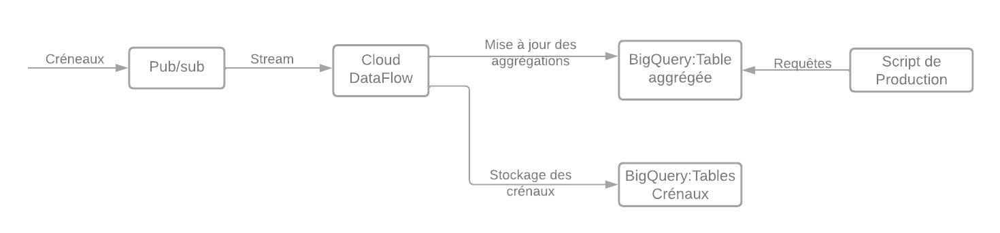

# Partie 2-b

## Question

Imagine maintenant que l'on a 100 000 000 de créneaux et qu'on a 1000 nouveaux
créneaux qui arrivent par seconde.
On dispose d'un modèle qui permet de labelliser les créneaux en fonction de
leur probabilité d'être réservés.
On aimerait que ce label soit donné au moment de la création du créneau
pour être utilisé en production.
Que proposerais-tu de mettre en place ? (on ne demande pas de créer
l'algorithme de prédiction, mais le process / la structure nécessaire à la mise
en production).

## Les propositions

Pour mettre en place le processus de prédiction de label lors de la création d'un créneau, voici les étapes que je
suggère :

1. Sauvegarder le modèle: Avant toute chose, il est nécessaire de sauvegarder le modèle de prédiction pour qu'il puisse
   être utilisé lors de la création de nouveaux créneaux.

2. Développer un service de prédiction : Ensuite, il faut développer un service de prédiction qui prendra en
   entrée les caractéristiques d'un nouveau créneau (comme les horaires, la date, la localisation, etc.) et renverra la
   probabilité de réservation calculée par le modèle.

3. Intégrer le service à l'application : Une fois que le service de prédiction est développé, il doit être intégré à
   l'application de création de créneaux. Ainsi, lorsqu'un utilisateur crée un nouveau créneau, l'application fera appel
   au
   service de prédiction pour obtenir le label de probabilité de réservation du créneau.

4. Mettre en place un système de monitoring : il est important de mettre en place un système de monitoring pour
   surveiller les performances du modèle et s'assurer qu'il continue de produire des prédictions précises. Si les
   performances du modèle se dégradent, il sera nécessaire de revoir et d'ajuster le modèle en conséquence.

Par exemple, le modèle pourrait être enregistrer dans un Bucket GCS. Ensuite un endpoint de prédiction dans Vertex AI
pourrait être créer et permettra de déployé le modèle entrainé et d'y accéder une API.

En ce qui concerne l'ingestion de données, il pourrait s'agir d'une architecture de type "streaming", dans laquelle on
pourrait utiliser Cloud Pub/Sub pour collecter les données de nouveaux créneaux à mesure qu'ils sont
créés.

Des instances Cloud Function pourraient être déclenchées à chaque fois qu'un créneau a été collecté par Pub/Sub. Ces
instances pourront envoyer des requêtes HTTP pour les demandes de prédiction à l'endpoint Vertex AI.
Une fois les prédictions reçues, les instances Cloud Function pourraient stocker les resultats dans un autre topic
Pub/sub.

Pour le système de monitoring du modèle, on pourrait utiliser les fonctionnalités intégrées de Vertex AI qui permettent
de configurer le suivi des métriques du modèle, le logging des prédictions, les alertes afin de permettre une analyse en
temps réel du modèle et l'améliorer ou le changer au besoin.

